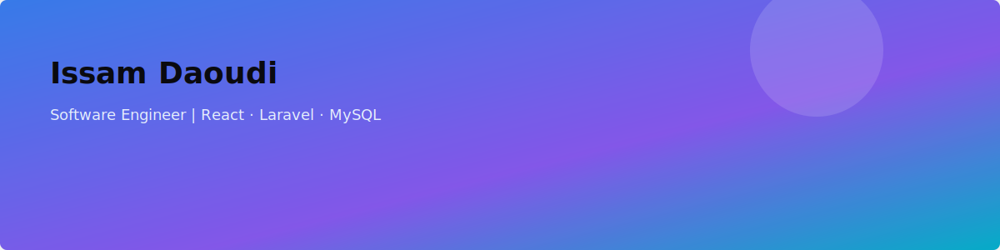

  

<h1 align="center">Hi, I'm Issam Daoudi</h1>
<h3 align="center">Software Engineer | Full-Stack Developer | React • Node.js • Laravel • MySQL</h3>

  
  

## About Me

I’m a passionate **software engineer** who learns by creating, exploring, and improving real-world projects. I love building **smart, scalable systems** that bring ideas to life from robust APIs in Laravel and Node.js to clean, responsive interfaces in React.

Above all, I enjoy working with people who share curiosity, kindness, and a sense of craftsmanship in software.

## Tech Stack

  
  
  
  
  
  
  
   
  
  
  
  
  
  
  

## Featured Projects

| Project                | Description                                                         | Links                                                                                                  |
| ---------------------- | ------------------------------------------------------------------- | ------------------------------------------------------------------------------------------------------ |
| **Personal Portfolio** | My centralized, bilingual portfolio with dark/light mode toggle.    | <a href="https://issamdaoudi.site/" target="_blank">Live Site</a>                                      |
| **Food Ordering**      | Multilingual, dynamic and responsive application for food ordering. | <a href="https://issamdi.github.io/food-ordering-website/index.html" target="_blank">Live Site</a>     |
| **Frontend Challenge** | A pixel-perfect implementation of a precise UI challenge.           | <a href="https://frontend-challenge-blue-five.vercel.app/" target="_blank">Live Site</a>               |
| **Pallet Management**  | Samples of an internal warehouse/logistics workflow system.         | <a href="https://issamdaoudi.site/Projects/work_samples_pallet_management.pdf" target="_blank">PDF</a> |

## Let's Connect

I love connecting with people who:

- Share knowledge generously
- Enjoy building meaningful things
- Believe in respect, curiosity, and kindness

📫 **Reach out to me on [LinkedIn](https://www.linkedin.com/in/issamdaoudi)**. I’d love to chat, learn, or collaborate!

---

## ✨ Fun Facts

- I use **Ubuntu Linux** as my main OS — stability, speed, and style combined 🐧
- I believe **small consistent progress beats intensity**.
- I find joy in making **clean commits** and **beautifully structured codebases**.
